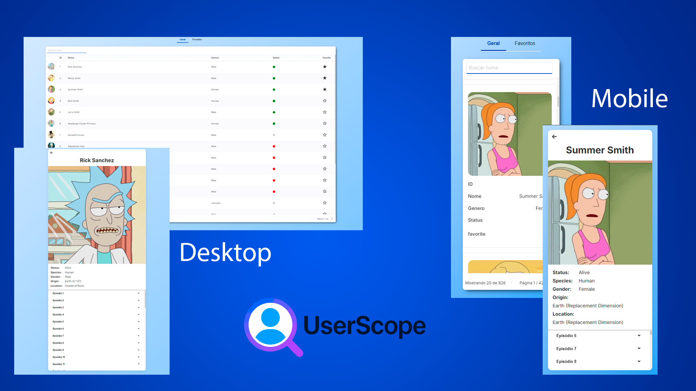

<h1 align="center">
  Desafio Técnico - Frontend React - Gerenciamento de Usuários
</h1>

<br>

<p align="center">
  
</p>

## ✨ Tecnologias

Esse projeto foi desenvolvido com as seguintes tecnologias:

- [React JS](https://pt-br.reactjs.org/)
- [Typescript](https://www.typescriptlang.org/)
- [Styled Components](https://styled-components.com/)
- [Docker](https://www.docker.com/)
- [Vitest](https://vitest.dev/)
- [i18next](https://www.i18next.com/)
- [GraphQL](https://graphql.org/)

## 💻 Projeto

UserScope é uma aplicação web desenvolvida em React para listagem, filtragem e gerenciamento de usuários consumindo APIs públicas. O projeto inclui funcionalidades como favoritar usuários, exibição de detalhes, filtros por nome e favoritos, além de uma interface moderna e responsiva construída com Styled Components e boas práticas de arquitetura frontend.

## 📚 Descrição

A aplicação permite:

- Listar usuários em cards, exibindo foto, nome e e-mail.
- Implementar paginação ou scroll infinito para carregar mais usuários.
- Visualizar detalhes adicionais de um usuário ao clicar em seu card.
- Favoritar/desfavoritar usuários, com persistência local (localStorage).
- Filtrar usuários por nome e favoritos.
- Exibir mensagens de sucesso ou erro e estado de loading ao buscar ou salvar dados.

## 📋 Requisitos Técnicos

- Consumo de API pública REST (ex.: Random User API ou Rick and Morty API).
- Gerenciamento de estado com React Context.
- Estilização com Styled Components.
- Testes unitários e boas práticas de clean code e arquitetura.
- Histórico de commits organizados seguindo "conventional commits".

## 🚀 Como executar

A aplicação pode ser executada localmente com ou sem o Docker.

1. Clone o repositório:

```bash
git clone https://github.com/ander5onPereira/user-scope.git
```

2. Acesse o diretório do projeto:

```bash
cd user-scope
```

3. Crie o arquivo **.env** com base no **.env.example** fornecido.

> Obs.: Utilizado API Rest rickandmortyapi usar a **VITE_API_URL=https://rickandmortyapi.com/api**

> Obs.: Utilizado API Graphql rickandmortyapi usar a **VITE_API_URL_GRAPHQL=https://rickandmortyapi.com/graphql**

### Execução com o Docker:

A execução é feita via Docker Compose. Certifique-se de ter o Docker e Docker Compose instalados no computador.

4. Inicie o projeto:

```bash
docker-compose up --build
```

5. Após o primeiro build, utilize o comando abaixo para iniciar rapidamente:

```bash
docker-compose up -d
```

6. Para parar o projeto:

```bash
docker-compose stop
```

7. Para excluir o ambiente do Docker:

```bash
docker-compose stop
```

### Execução sem o Docker:

A execução é feita diretamente no terminal. Certifique-se de ter o Node.js instalado no computador.

4. Instale as dependências:

```bash
npm install
```

5. Execute o servidor:

```bash
npm run dev
```

Acesse a aplicação em http://localhost:5173.

## 🔧 Decisões Técnicas

- ViteJS: Escolhido pela simplicidade e rapidez no desenvolvimento de projetos pequenos, com recarregamento rápido e suporte ao ES6.
- React Context: Utilizado para gerenciamento de estado devido à sua integração nativa com React e simplicidade para este projeto.
- Styled Components: Escolhido pela facilidade de estilização e compatibilidade com o ViteJS e React.
- Docker: Incluído para facilitar a execução do projeto em diferentes ambientes.
- APIs Públicas: Consumo de APIs públicas para fornecer dados de exemplo, api utilizada foi rickand and morty.
- i18next: Utilizado para suporte a múltiplas línguas, com suporte a traduções e recursos de internacionalização.

> Obs.: Nessa banch graphql foi realiza a integração com o Graphql, para realizar a busca do dados, para não efetar em nada a aplicação desenvolvida primeiramente em Rest, os retornos do Graphql foram formatados para que fossem compatíveis com o Rest.

## 🧪 Testes

- Testes unitários foram implementados utilizando Vitest e React Testing Library.
- Exemplos de testes incluem a funcionalidade de favoritar usuários.

## 💻 Acesso a aplicação

### [**User Scope**](https://user-scope.arpdev.com.br/)
